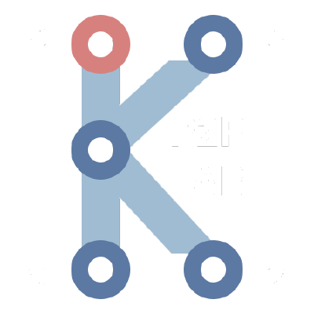

# K-P2PLab Ideabed

    </img>
    <h3><code>Welcome to K-P2PLab!</code></h3>

## Objective
> ***A Scalable Docker Swarm-based Testbed Platform for P2P Simulation and Analysis***

### How

🚧

## Architecture

## Related Work about K-P2PLab
> - Paper for [K-P2PLab v1\(KNOM Review, Dec. 2024, KR\)](https://doi.org/10.22670/knom.2024.27.2.40)
> - Paper for [K-P2PLab v2\(25th APNOMS, Sep. 2025, EN\)](https://doi.org/10.23919/APNOMS67058.2025.11181317)
>

## Related Work using K-P2PLab